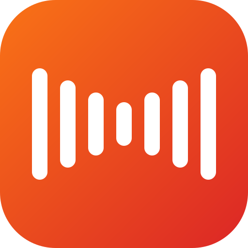

<div align="center">



# LeVoice

**Less voice, more action.**
100% on-device voice-to-text and macOS hotkey utilities. No cloud APIs, no telemetry, no data leaves your Mac.

<a href="https://github.com/aryateja2106/levoice/releases/latest/download/LeVoice.dmg">
  
</a>

macOS 14.0+ · Apple Silicon · MIT licensed

[](https://github.com/aryateja2106/levoice)
&nbsp;
[](LICENSE)
&nbsp;


</div>

## Features

- **Hold to talk** — press a chord, speak, release, text pastes into any focused field
- **Local speech models** — Whisper / FluidAudio Parakeet, bundled and cached on your Mac
- **Local cleanup** — small Qwen LLM removes filler words and fixes self-corrections
- **Menu-bar only** — no dock icon, no window, just there when you need it
- **Customizable chords** — rebind push-to-talk and toggle-to-record to any key combo
- **Signed + notarized** — installs clean through Gatekeeper, no right-click workaround

## Install

1. Download [LeVoice.dmg](https://github.com/aryateja2106/levoice/releases/latest/download/LeVoice.dmg) from the latest release
2. Open it, drag **LeVoice** into **Applications**
3. Launch from Spotlight (`⌘Space` → "LeVoice")
4. Grant **Microphone**, **Accessibility**, and **Input Monitoring** on first launch (System Settings → Privacy & Security)

## Default shortcuts

| Action | Keys |
|---|---|
| Hold to record | Right ⌘ + Right ⌥ (hold) |
| Toggle recording | Right ⌘ + Right ⌥ + Space |

Change in **Settings → Recording → Shortcuts**.

## How it works

LeVoice runs everything on your Mac via Apple Silicon. The first launch downloads a small Whisper model (~100 MB) into `~/Library/Application Support/LeVoice/` and caches it.

| Component | Powered by |
|---|---|
| Speech-to-text | [WhisperKit](https://github.com/argmaxinc/WhisperKit), [FluidAudio](https://github.com/FluidInference/FluidAudio) |
| Text cleanup LLM | [LLM.swift](https://github.com/obra/LLM.swift) (llama.cpp) |
| Model hosting | [Hugging Face](https://huggingface.co/) (download only) |

## Privacy

| Feature | What stays on your Mac |
|---|---|
| Microphone audio | ✅ Never uploaded |
| Transcriptions | ✅ Only go to your clipboard / focused text field |
| LLM cleanup | ✅ Runs via llama.cpp locally |
| Meeting summaries | ✅ Local LLM, saved as markdown on disk |
| Telemetry / analytics | ❌ None. No Sentry, Mixpanel, Firebase, or custom pings |

The only outbound network calls are one-time model downloads from Hugging Face. See [PRIVACY_AUDIT.md](PRIVACY_AUDIT.md) for the verification prompt.

## Build from source

```bash
brew install xcodegen
git clone https://github.com/aryateja2106/levoice.git
cd levoice
xcodegen generate
open LeVoice.xcodeproj
# Cmd+R to build + run
```

To produce a signed DMG: see [RELEASE.md](RELEASE.md).

## License

MIT — see [LICENSE](LICENSE).

Forked from [matthartman/ghost-pepper](https://github.com/matthartman/ghost-pepper); rebranded and redirected toward a broader "macOS micro-interactions" scope under the LeVoice project.
